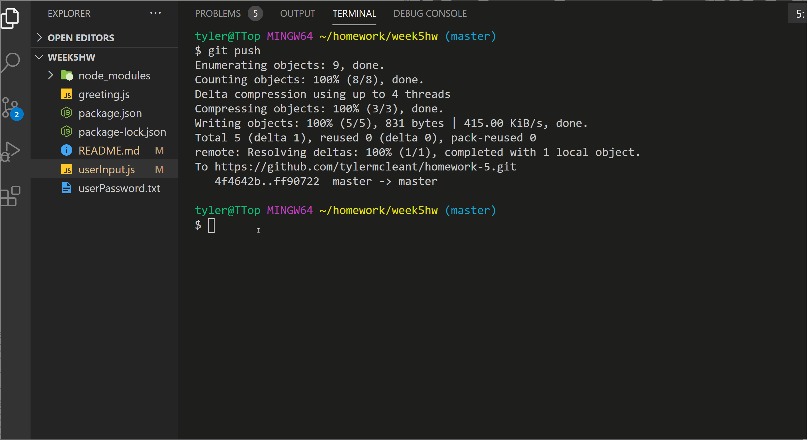

# Pseudo Code Worksheet: 

What was the user story? 
 - This user needed to have a server log in for the background use of their app. 

 What was the main solution? 
  - In using the inquirer library from the node package manager, it was the guiding framework to ask questions on the backend without having to create completely original code. 

## GIF for the Server Demonstration 

